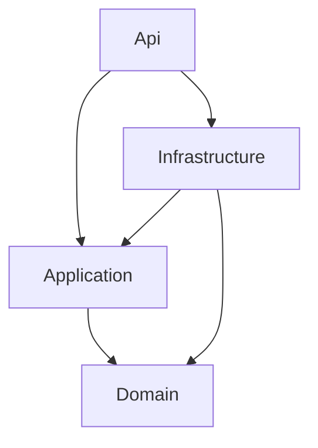

# Setup project

## Download and install .NET on Linux WSL

1) Download
```bash
wget https://dot.net/v1/dotnet-install.sh -O dotnet-install.sh
```

2) Grant permission
```bash
chmod +x ./dotnet-install.sh
```

3) Install
```bash
./dotnet-install.sh --version latest
```

4) Set env variables
```bash
printf '\nexport DOTNET_ROOT=$HOME/.dotnet\nexport PATH=$PATH:$DOTNET_ROOT:$DOTNET_ROOT/tools\n' >> ~/.bashrc
```


## Setup very basic clean architecture

```bash
dotnet new webapi -n Api -o src/Api
dotnet new classlib -n Application -o src/Application
dotnet new classlib -n Domain -o src/Domain
dotnet new classlib -n Infrastructure -o src/Infrastructure

dotnet new xunit -n UnitTests -o tests/UnitTests
dotnet new xunit -n IntegrationTests -o tests/IntegrationTests
```

## Add projects to solution file
```bash
dotnet sln add src/**/*.csproj
dotnet sln add tests/**/*.csproj
```

## Add project references

Each project can only reference the ones below it. Api also references Infrastructure, but only to wire things up at startup.



### Api
```bash
dotnet add src/Api reference src/Application
dotnet add src/Api reference src/Infrastructure
```

### Application
```bash
dotnet add src/Application reference src/Domain
```

### Infrastructure
```bash
dotnet add src/Infrastructure reference src/Application
dotnet add src/Infrastructure reference src/Domain
```

### Tests
```bash
dotnet add tests/UnitTests reference src/Application
dotnet add tests/UnitTests reference src/Domain
dotnet add tests/IntegrationTests reference src/Api
```

## Debugging
Install VSCode extensions (might need to close VSCode, kill vscode processes and start again after install)
* C#
* C# Dev Kit

## Run
First start Docker and compose up. Then the app can be started.

```bash
docker compose up -d
```

# Release

## Build locally
```bash
docker build -t dishesapp .
```

## Run

`EXPOSE 8080` only documents the port — it doesn't publish it, so map it explicitly. The connection string also isn't set in
`src/Api/appsettings.json`, so pass one pointing at a database with the required migrations applied.

```bash
docker run -p 8080:8080 -e ConnectionStrings__DishesDb="Host=host.docker.internal;Port=5432;Database=dishes;Username=postgres;Password=postgres" dishesapp
```

Alternatively, push the image (e.g. via GitHub Actions) to AWS ECS and host it there (database is still required).